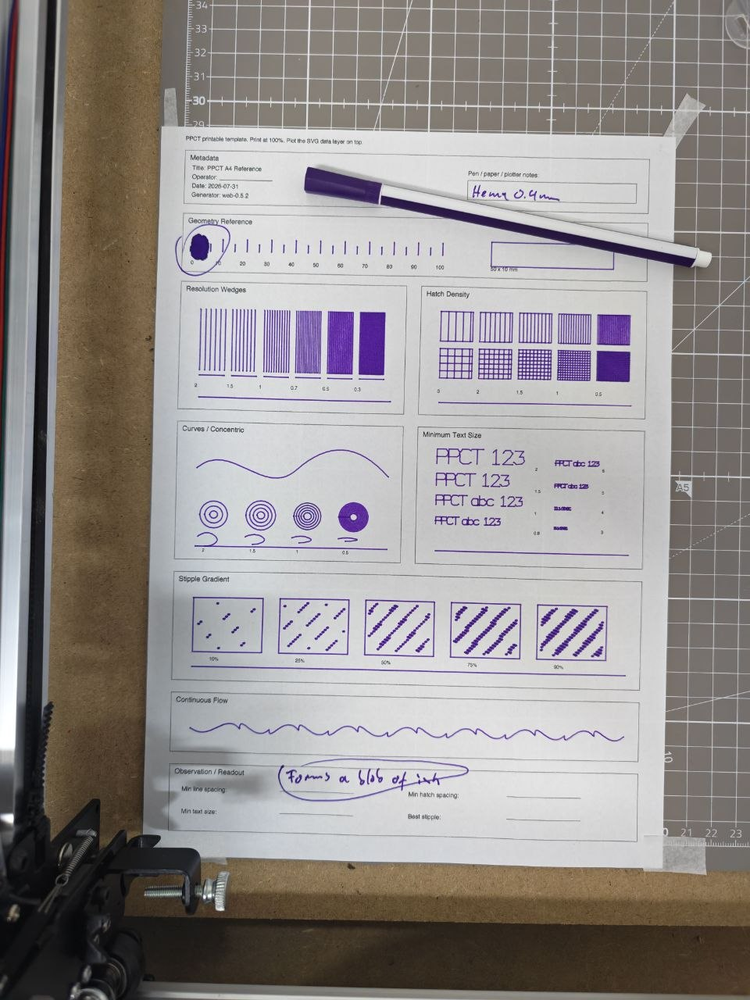

# 2026-07-31 — HEMA 0.4 mm fineliner

Physical PPCT capture from the first practical A4 reference run.

## Metadata visible on the sheet

- Title: PPCT A4 Reference
- Date: 2026-07-31
- Generator: web-0.5.2
- Pen note: HEMA 0.4 mm

## Observation

- The geometry reference shows a heavy blob at the first pen-down / fill area.
- Handwritten note on the sheet: "formed a blob of ink".
- The image is a reference capture, not a measured scan. Use it as qualitative evidence for the real plotted behaviour of this pen and setup.
