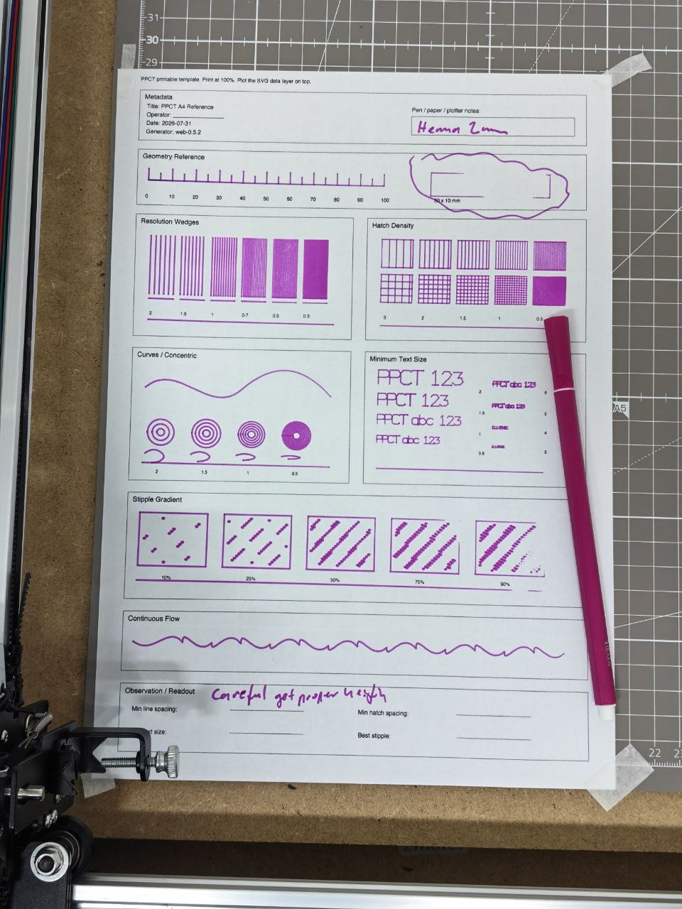

# 2026-07-31 — HEMA 2 mm marker

Physical PPCT capture from an A4 reference run with a thicker HEMA pen.

## Metadata visible on the sheet

- Title: PPCT A4 Reference
- Date: 2026-07-31
- Generator: web-0.5.2
- Pen note: HEMA 2 mm

## Observation

- The thick marker still produces usable large geometry, curves, hatches, and flow marks.
- Fine text and the densest resolution, hatch, and stipple areas are crowded or filled in.
- Handwritten note on the sheet appears to read: "Careful yet maybe useful".
- The image is a reference capture, not a measured scan. Use it as qualitative evidence for the real plotted behaviour of this pen and setup.
